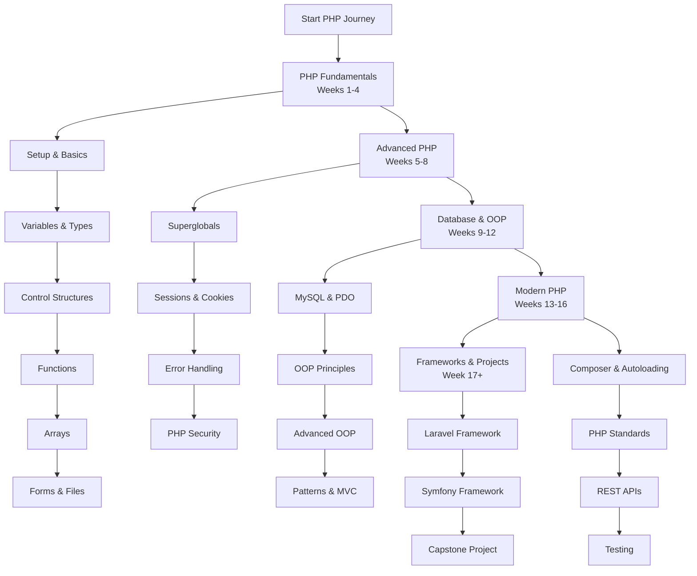

# PHP Developer Learning Path: A Structured Curriculum

This comprehensive roadmap provides a structured approach to mastering PHP development. The curriculum is designed sequentially, with each module building upon previous knowledge to ensure a solid foundation and progressive skill development.

---

## Phase 1: PHP Fundamentals & Basic Syntax (Weeks 1-4)

*   [**Module 1: Introduction & Development Environment**](https://github.com/example/php-intro/#readme)
    *   PHP Overview: History, Use Cases, and Server-Side Scripting
    *   Setting Up Development Environment: XAMPP, WAMP, or Docker
    *   Configuring Web Server (Apache/Nginx) and PHP
    *   Choosing an IDE: PHPStorm, VS Code, or Sublime Text
    *   Creating and Running First PHP Script: `<?php echo "Hello World"; ?>`

*   [**Module 2: Basic Syntax & Program Structure**](https://github.com/example/php-syntax/#readme)
    *   PHP Tags: `<?php ?>`, `<?= ?>`, and Alternative Syntax
    *   Comments: Single-line (`//`, `#`) and Multi-line (`/* */`)
    *   PHP Instructions and Semicolon Usage
    *   Embedding PHP in HTML and Outputting Data

*   [**Module 3: Variables, Constants, and Data Types**](https://github.com/example/php-variables/#readme)
    *   Variable Declaration: `$variable_name` and Dynamic Typing
    *   Data Types: Scalar (int, float, string, bool), Compound (array, object), Special (null, resource)
    *   Type Juggling and Type Casting
    *   Constants: `define()` and `const`
    *   Variable Scope: Global, Local, Static

*   [**Module 4: Operators and Expressions**](https://github.com/example/php-operators/#readme)
    *   Arithmetic Operators: `+`, `-`, `*`, `/`, `%`, `**`
    *   Assignment Operators: `=`, `+=`, `-=`, `*=`, `/=`
    *   Comparison Operators: `==`, `===`, `!=`, `!==`, `>`, `<`, `>=`, `<=`
    *   Logical Operators: `&&`, `||`, `!`, `and`, `or`, `xor`
    *   String Operators: `.`, `.=`
    *   Increment/Decrement: `++`, `--`

*   [**Module 5: Control Structures**](https://github.com/example/php-control-structures/#readme)
    *   Conditional Statements: `if`, `else`, `elseif`, `switch`
    *   Looping Structures: `for`, `while`, `do-while`, `foreach`
    *   Alternative Syntax for Control Structures
    *   Loop Control: `break`, `continue`, `goto`

*   [**Module 6: Arrays and Strings**](https://github.com/example/php-arrays/#readme)
    *   Array Types: Indexed, Associative, Multidimensional
    *   Array Functions: `count()`, `sort()`, `array_merge()`, `array_push()`, etc.
    *   String Functions: `strlen()`, `strpos()`, `substr()`, `str_replace()`, etc.
    *   Working with JSON: `json_encode()`, `json_decode()`

---

## Phase 2: Advanced PHP Programming (Weeks 5-8)

*   [**Module 7: Functions**](https://github.com/example/php-functions/#readme)
    *   Function Declaration and Invocation
    *   Parameters: Default Values, Type Declarations, Variable-length Arguments
    *   Return Values and Return Type Declarations
    *   Variable Functions and Anonymous Functions
    *   Arrow Functions and Callbacks

*   [**Module 8: Superglobal Variables**](https://github.com/example/php-superglobals/#readme)
    *   `$_GET` - Handling URL Parameters
    *   `$_POST` - Processing Form Data
    *   `$_REQUEST` - Combined GET/POST Data
    *   `$_SERVER` - Server and Execution Environment Information
    *   `$_FILES` - File Upload Handling
    *   `$_ENV` - Environment Variables

*   [**Module 9: Forms and File Handling**](https://github.com/example/php-forms/#readme)
    *   Creating HTML Forms with PHP Processing
    *   Form Validation: Required Fields, Data Format, Sanitization
    *   File Uploads: Configuration, Security, and Storage
    *   Reading and Writing Files: `fopen()`, `fread()`, `fwrite()`, `file_get_contents()`

*   [**Module 10: Sessions and Cookies**](https://github.com/example/php-sessions/#readme)
    *   Cookie Management: `setcookie()`, `$_COOKIE`
    *   Session Management: `session_start()`, `$_SESSION`
    *   Session Configuration and Security
    *   Implementing User Authentication Systems

---

## Phase 3: Database Integration & OOP (Weeks 9-12)

*   [**Module 11: MySQL Database Integration**](https://github.com/example/php-mysql/#readme)
    *   MySQL Basics: Databases, Tables, CRUD Operations
    *   MySQLi Extension: Connection, Queries, Prepared Statements
    *   PDO (PHP Data Objects): Database Abstraction Layer
    *   Preventing SQL Injection with Prepared Statements
    *   Database Design and Normalization

*   [**Module 12: Object-Oriented Programming (OOP)**](https://github.com/example/php-oop/#readme)
    *   Classes and Objects: Properties and Methods
    *   Constructors and Destructors: `__construct()`, `__destruct()`
    *   Visibility Modifiers: `public`, `protected`, `private`
    *   Inheritance and the `extends` Keyword
    *   Method Overriding and Parent Calls

*   [**Module 13: Advanced OOP Concepts**](https://github.com/example/php-advanced-oop/#readme)
    *   Interfaces and Abstract Classes
    *   Static Methods and Properties
    *   Magic Methods: `__get()`, `__set()`, `__toString()`, etc.
    *   Namespaces and Autoloading with `spl_autoload_register()`
    *   Traits for Code Reuse

*   [**Module 14: Error Handling and Exceptions**](https://github.com/example/php-error-handling/#readme)
    *   Error Types: Notices, Warnings, Fatal Errors
    *   Custom Error Handlers: `set_error_handler()`
    *   Exception Handling: `try`, `catch`, `finally`, `throw`
    *   Creating Custom Exception Classes

---

## Phase 4: Modern PHP Development (Weeks 13-16)

*   [**Module 15: PHP Security Best Practices**](https://github.com/example/php-security/#readme)
    *   Input Validation and Sanitization
    *   Cross-Site Scripting (XSS) Prevention
    *   Cross-Site Request Forgery (CSRF) Protection
    *   Password Hashing: `password_hash()`, `password_verify()`
    *   SQL Injection Prevention and Data Encryption

*   [**Module 16: Composer and Dependency Management**](https://github.com/example/php-composer/#readme)
    *   Introduction to Composer and Packagist
    *   `composer.json` Configuration and Autoloading
    *   Installing and Managing Packages
    *   Creating Custom Packages

*   [**Module 17: PHP Standards and Best Practices**](https://github.com/example/php-standards/#readme)
    *   PSR Standards: PSR-1, PSR-4, PSR-12
    *   Code Organization and Project Structure
    *   PHP-FIG and Framework Interoperability
    *   Performance Optimization and Caching

*   [**Module 18: RESTful API Development**](https://github.com/example/php-api/#readme)
    *   REST Principles and HTTP Methods
    *   Building RESTful Endpoints
    *   JSON Response Handling and HTTP Status Codes
    *   API Authentication: JWT, OAuth
    *   API Documentation with OpenAPI/Swagger

---

## Phase 5: Frameworks & Professional Development

*   [**Module 19: Laravel Framework**](https://github.com/example/php-laravel/#readme)
    *   Laravel Installation and Project Structure
    *   Eloquent ORM and Database Migrations
    *   Routing, Controllers, and Blade Templates
    *   Middleware, Authentication, and Authorization
    *   Laravel Ecosystem: Livewire, Nova, Horizon

*   [**Module 20: Symfony Framework**](https://github.com/example/php-symfony/#readme)
    *   Symfony Components and Framework Installation
    *   Doctrine ORM and Entity Management
    *   Twig Templating Engine
    *   Symfony Console and Command Creation
    *   Bundles and Dependency Injection

*   [**Module 21: Testing and Debugging**](https://github.com/example/php-testing/#readme)
    *   Unit Testing with PHPUnit
    *   Test-Driven Development (TDD) Practices
    *   Debugging with Xdebug and var_dump/print_r
    *   Browser Testing with Selenium or Codeception

*   [**Module 22: Deployment and DevOps**](https://github.com/example/php-deployment/#readme)
    *   Server Configuration and PHP-FPM Setup
    *   Deployment Strategies: FTP, Git, CI/CD Pipelines
    *   Docker Containerization for PHP Applications
    *   Performance Monitoring and Logging

---

## Phase 6: Capstone Projects & Specialization

*   [**Module 23: E-Commerce Project**](https://github.com/example/php-ecommerce/#readme)
    *   Shopping Cart Implementation
    *   Payment Gateway Integration (Stripe, PayPal)
    *   Order Management and Inventory System
    *   Customer Management and Reviews

*   [**Module 24: Content Management System (CMS)**](https://github.com/example/php-cms/#readme)
    *   User Role Management and Permissions
    *   Dynamic Content Creation and Editing
    *   Media Management and File Uploads
    *   Theme and Plugin Architecture

*   [**Module 25: Specialization Paths**](https://github.com/example/php-specialization/#readme)
    *   **WordPress Development:** Theme and Plugin Development
    *   **E-commerce Specialist:** Magento, WooCommerce
    *   **API Specialist:** Microservices and API Architecture
    *   **Full-Stack PHP Developer:** Frontend Integration (Vue.js, React)

*   [**Module 26: Career Preparation**](https://github.com/example/php-career/#readme)
    *   Building a Professional Portfolio
    *   PHP Job Market and Salary Expectations
    *   Open Source Contribution and Community Involvement
    *   Continuous Learning and PHP 8+ Features

---

## Learning Resources

*   **Official Documentation:** [PHP.net Manual](https://www.php.net/manual/)
*   **PHP The Right Way:** [phptherightway.com](https://phptherightway.com/)
*   **Packagist:** [packagist.org](https://packagist.org/) - PHP Package Repository
*   **Community:** PHP.net mailing lists, Reddit, Stack Overflow
*   **Books:** "Modern PHP", "PHP Objects, Patterns, and Practice"

*Note: Replace `https://github.com/example/` with actual repository links for each module.*
